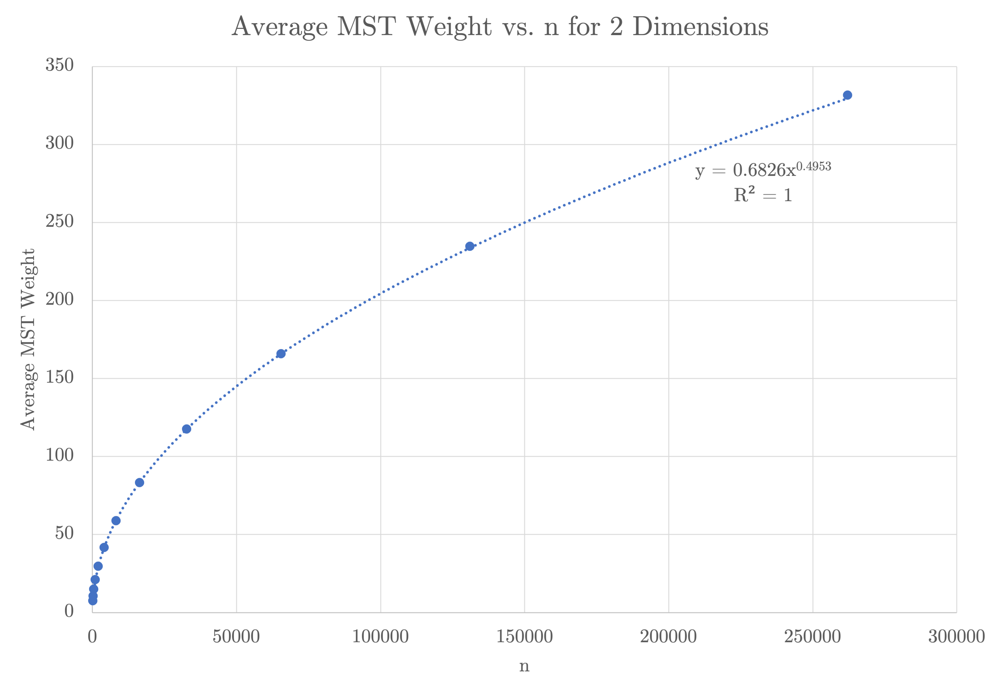

# CS 124: Random Minimum Spanning Trees
## Albert Qi and Steve Dalla
### February 22, 2023

## Table of Contents
1. Introduction
2. Pruning Thresholds
3. Results
4. Discussion of Experiments

## 1. Introduction

In this write-up, we determine how the expected weight of the minimum spanning tree (hereinafter called MST) grows as a function of $n$ (the number of vertices) for each of the three given cases. We will first talk about our pruning thresholds for each case and then break down our results for each case. Finally, we will discuss our experiments in more depth, covering the asymptotic runtime of our algorithm and other issues we came across along the way.

## 2. Pruning Thresholds

The biggest challenge for this project is figuring out how to handle large values of $n$. A complete graph with $n=262144$ vertices has over 34 billion edges; it is unreasonable to run Prim's algorithm on graphs of this magnitude. Thus, we need to find a way to prune edges that are extremely unlikely to be included in the MST.

Say we have some arbitrary complete graph $G$. If we knew the maximum edge weight $w$ in the MST of $G$, then we could prune all edges in $G$ that have a weight larger than $w$ since we know that these will not be included in the MST. So, how can we find the maximum edge weight of $G$ before we spend time constructing it?

We cannot find the exact value of $w$ for $G$, but we can estimate $w$ by looking at the maximum edge weights for smaller values of $n$. Then, we can construct a function $w(n)$ that returns the expected maximum edge weight as a function of $n$.

For each case, we find the actual maximum edge weight for $n\in\{128,\,256,\,512,\,1024,\,2048,\,4096\}$. That is, for each of these values of $n$, we construct an MST by running Prim's algorithm on the complete graph and then find the maximum edge weight in the MST.

Case 1: Edge weights are i.i.d. $\mathrm{Unif}(0,\,1)$. The max edge weight is averaged over 16 trials.

| $n$         | Max Edge Weight |
| :----------:| :-------------: |
| 128         | 0.0436          |
| 256         | 0.0253          |
| 512         | 0.0140          |
| 1024        | 0.00782         |
| 2048        | 0.00401         |
| 4096        | 0.00224         |

We can then graph these results to find $w(n)$.

As we can see by the graph, the maximum edge weights seem to align with the following function:

$$w(n)=\dfrac{3}{n^{0.864}}\text{ for edges }\mathrm{Unif}(0,\,1)$$

Case 2: Edge weights are generated in a Euclidean MST with 2 dimensions. The max edge weight is averaged over 16 trials.

| $n$         | Max Edge Weight |
| :---------: | :-------------: |
| 128         | 0.148           |
| 256         | 0.109           |
| 512         | 0.0798          |
| 1024        | 0.0565          |
| 2048        | 0.0419          |
| 4096        | 0.0295          |

Case 3: Edge weights are generated in a Euclidean MST with 3 dimensions. The max edge weight is averaged over 16 trials.

| $n$         | Max Edge Weight |
| :---------: | :-------------: |
| 128         | 0.279           |
| 256         | 0.224           |
| 512         | 0.183           |
| 1024        | 0.147           |
| 2048        | 0.116           |
| 4096        | 0.0961          |

Case 4: Edge weights are generated in a Euclidean MST with 4 dimensions. The max edge weight is averaged over 16 trials.

| $n$         | Max Edge Weight |
| :---------: | :-------------: |
| 128         | 0.392           |
| 256         | 0.340           |
| 512         | 0.288           |
| 1024        | 0.243           |
| 2048        | 0.213           |
| 4096        | 0.181           |

We can then graph these results for 2, 3, and 4 dimensions to find $w(n,\,d)$.

While we could just use the trendlines as our function $w(n,\,d)$, the maximum edge weights seem to follow roughly the same shape, meaning there should be one function $w(n,\,d)$ that simultaneously captures 2, 3, and 4 dimensions. According to Penrose's paper on "The longest edge of the random minimal spanning tree", we can conclude that $(w,\,d)$ might be the following:

$$w(n,\,d)=\left(\dfrac{\log_2 n}{\pi n}\right)^{1/d}\text{ for Euclidean MSTs with dimension }d$$

To confirm our hypothesis, we plot $w(n,\,d)$ alongside the actual maximum edge weights for each case. 

Our maximum edge weights align very closely to $w(n,\,d)$, meaning our function $w(n,\,d)$ will be the following:

$$w(n,\,d)=
\begin{cases}
    \dfrac{3}{n^{0.864}}&\text{for edges }\mathrm{Unif}(0,\,1)\\[8pt]
    \left(\dfrac{\log_2 n}{\pi n}\right)^{1/d}&\text{for Euclidean MSTs with dimension }d
\end{cases}$$

However, we still need to account for the variance of the maximum edge weights. That is, because we are generating our edges in a random fashion, it is likely that some maximum edge weights will exceed $w(n,\,d)$. To adjust for this, we will simply multiply our $w(n,\,d)$ by 1.5. This gives us the following pruning threshold $k(n,\,d)$:

$$\begin{aligned}k(n,\,d)&=1.5\cdot w(n,\,d)\\
&=\begin{cases}
    1.5\cdot\dfrac{3}{n^{0.864}}&\text{for edges }\mathrm{Unif}(0,\,1)\\[8pt]
    1.5\cdot\left(\dfrac{\log_2 n}{\pi n}\right)^{1/d}&\text{for Euclidean MSTs with dimension }d
\end{cases}\end{aligned}$$

So, when we generate the edges for some complete graph $G$, we will test if the weight of the edge exceeds $k(n,\,d)$. If so, we will not include it in our graph. This drastically decreases the time required to construct our graphs.

## 3. Results

For each pruned graph, we run 16 trials and calculate the average MST weight, average runtime for graph construction, and average runtime for Prim's algorithm. For lower values of $n$, we manually check that the results are reasonable since the maximum edge weights are more likely to exceed our thresholds.

Case 1: Edge weights are i.i.d. $\mathrm{Unif}(0,\,1)$. The MST weight and runtimes are averaged over 16 trials.

| $n$    | MST Weight | Runtime for Graph Construction (sec.) | Runtime for Prim's Algorithm (sec.) |
| :----: | :--------: | :-----------------------------------: | :---------------------------------: |
| 128    | 1.201      | 0.000919                              | 0.000130                            |
| 256    | 1.208      | 0.00133                               | 0.000386                            |
| 512    | 1.206      | 0.00608                               | 0.000760                            |
| 1024   | 1.204      | 0.0211                                | 0.00167                             |
| 2048   | 1.210      | 0.0742                                | 0.00301                             |
| 4096   | 1.205      | 0.270                                 | 0.00542                             |
| 8192   | 1.200      | 1.038                                 | 0.0138                              |
| 16384  | 1.201      | 4.098                                 | 0.0465                              |
| 32768  | 1.202      | 16.686                                | 0.133                               |
| 65536  | 1.199      | 65.756                                | 0.454                               |
| 131072 | 1.200      | 261.102                               | 1.493                               |
| 262144 | 1.201      | 1039.243                              | 4.624                               |

We can then graph these results to find $f(n)$.

As we can see by the graph, the expected MST weights seem to align with the following function:

$$f(n)=1.2\text{ for edges }\mathrm{Unif}(0,\,1)$$

Case 2: Edge weights are generated in a Euclidean MST with 2 dimensions. The MST weight and runtimes are averaged over 16 trials.

| $n$    | MST Weight | Runtime for Graph Construction (sec.) | Runtime for Prim's Algorithm (sec.) |
| :----: | :--------: | :-----------------------------------: | :---------------------------------: |
| 128    | 7.622      | 0.00240                               | 0.000259                            |
| 256    | 10.673     | 0.00726                               | 0.000460                            |
| 512    | 14.987     | 0.0435                                | 0.00131                             |
| 1024   | 21.053     | 0.120                                 | 0.00208                             |
| 2048   | 29.677     | 0.466                                 | 0.00503                             |
| 4096   | 41.752     | 1.807                                 | 0.0141                              |
| 8192   | 58.889     | 7.300                                 | 0.0290                              |
| 16384  | 83.199     | 29.362                                | 0.0946                              |
| 32768  | 117.546    | 122.259                               | 0.201                               |
| 65536  | 165.948    | 488.778                               | 0.709                               |
| 131072 | 234.658    | 2040.865                              | 1.662                               |
| 262144 | 331.655    | 8510.621                              | 11.327                              |

We can then graph these results to find $f(n)$.

As we can see by the graph, the expected MST weights seem to align with the following function:

$$f(n)=0.68n^{1/2}\text{ for Euclidean MSTs with dimension }2$$

Case 3: Edge weights are generated in a Euclidean MST with 3 dimensions. The MST weight and runtimes are averaged over 16 trials.

| $n$    | MST Weight | Runtime for Graph Construction (sec.) | Runtime for Prim's Algorithm (sec.) |
| :----: | :--------: | :-----------------------------------: | :---------------------------------: |
| 128    | 17.558     | 0.00241                               | 0.000308                            |
| 256    | 27.525     | 0.00687                               | 0.000543                            |
| 512    | 43.391     | 0.0382                                | 0.000917                            |
| 1024   | 68.276     | 0.128                                 | 0.00293                             |
| 2048   | 107.251    | 0.495                                 | 0.00688                             |
| 4096   | 169.250    | 1.942                                 | 0.0178                              |
| 8192   | 267.089    | 7.670                                 | 0.0420                              |
| 16384  | 422.639    | 30.217                                | 0.110                               |
| 32768  | 668.668    | 123.426                               | 0.322                               |
| 65536  | 1058.134   | 506.904                               | 0.969                               |
| 131072 | 1676.969   | 2069.100                              | 5.976                               |
| 262144 | 2657.826   | 8728.478                              | 122.507                             |

We can then graph these results to find $f(n)$.

As we can see by the graph, the expected MST weights seem to align with the following function:

$$f(n)=0.71n^{2/3}\text{ for Euclidean MSTs with dimension }3$$

Case 4: Edge weights are generated in a Euclidean MST with 4 dimensions. The MST weight and runtimes are averaged over 16 trials.

| $n$    | MST Weight | Runtime for Graph Construction (sec.) | Runtime for Prim's Algorithm (sec.) |
| :----: | :--------: | :-----------------------------------: | :---------------------------------: |
| 128    | 28.583     | 0.00246                               | 0.000339                            |
| 256    | 47.356     | 0.00742                               | 0.000621                            |
| 512    | 78.076     | 0.0327                                | 0.00192                             |
| 1024   | 130.051    | 0.123                                 | 0.00254                             |
| 2048   | 216.366    | 0.509                                 | 0.00897                             |
| 4096   | 361.301    | 1.939                                 | 0.0205                              |
| 8192   | 603.238    | 7.780                                 | 0.0568                              |
| 16384  | 1009.273   | 31.189                                | 0.137                               |
| 32768  | 1688.158   | 124.996                               | 0.410                               |
| 65536  | 2827.782   | 504.951                               | 1.285                               |
| 131072 | 4741.223   | 2084.392                              | 29.771                              |
| 262144 | 7949.608   | 9406.927                              | 931.810                             |

We can then graph these results to find $f(n)$.

As we can see by the graph, the expected MST weights seem to align with the following function:

$$f(n)=0.78n^{3/4}\text{ for Euclidean MSTs with dimension }4$$

## 4. Discussion of Experiments

First, we chose to use 